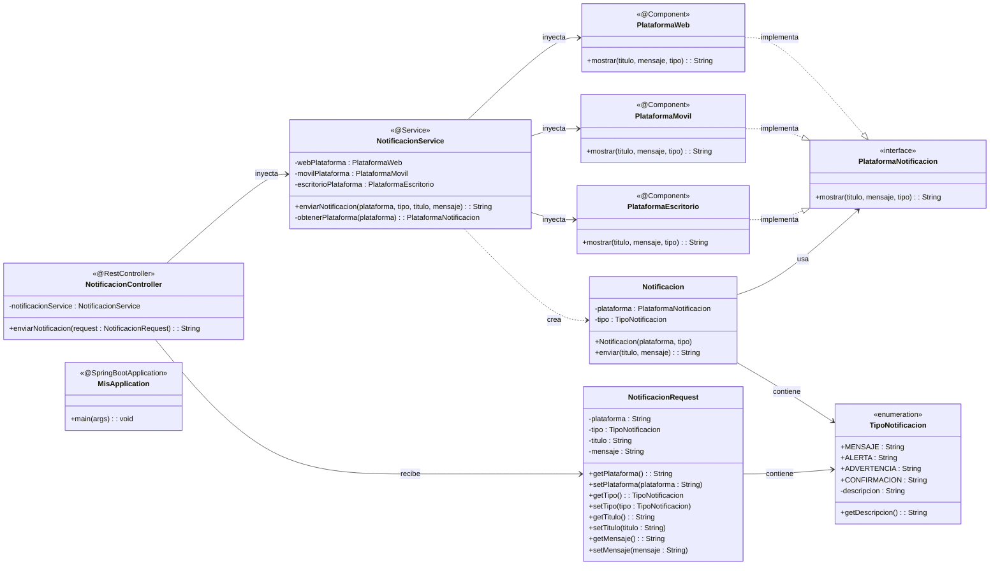
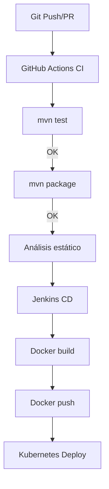

# Solución
### 🎨 Diagrama de Clases de la Solución


## 🚀 Tecnologías


### Stack Tecnológico

| Tecnología | Versión | Propósito |
|------------|---------|-----------|
| **Java** | 17 | Lenguaje de programación principal |
| **Spring Boot** | 3.5.6 | Framework para aplicaciones web |
| **Spring Web** | - | API REST endpoints |
| **Maven** | 3.6+ | Gestión de dependencias y build |
| **Lombok** | Latest | Reducción de código boilerplate |


## 📡 API Endpoints

### 🎯 Base URL
### 📋 Endpoints Disponibles

### **Enviar Notificación**

POST /mis/notificaciones/

Content-Type: application/json

Accept: application/json

#### Ejemplo 1: Notificación Web
```
curl -X POST http://HOST:PORT/api/notificaciones \
  -H "Content-Type: application/json" \
  -d '{
    "plataforma": "web",
    "tipo": "MENSAJE", 
    "titulo": "Bienvenido",
    "mensaje": "Usuario registrado exitosamente"
  }'
Respuesta:
[WEBMensaje] Bienvenido: Usuario registrado exitosamente
```


#### Ejemplo 2: Alerta Móvil
```
curl -X POST http://HOST:PORT/mis/notificaciones/ \
  -H "Content-Type: application/json" \
  -d '{
    "plataforma": "movil",
    "tipo": "ALERTA",
    "titulo": "Error Crítico",
    "mensaje": "Fallo en el sistema de pagos"
  }'
Respuesta:
[MovilAlerta] Error Crítico: Fallo en el sistema de pagos
```


#### Ejemplo 3: Advertencia Escritorio
```
curl -X POST http://HOST:PORT/mis/notificaciones/ \
  -H "Content-Type: application/json" \
  -d '{
    "plataforma": "escritorio",
    "tipo": "ADVERTENCIA",
    "titulo": "Mantenimiento",
    "mensaje": "El sistema se reiniciará en 5 minutos"
  }'
Respuesta:
[EscritorioAdvertencia] Mantenimiento: El sistema se reiniciará en 5 minutos
```


#### Ejemplo 4: Confirmación
```
curl -X POST http://HOST:PORT/mis/notificaciones/ \
  -H "Content-Type: application/json" \
  -d '{
    "plataforma": "web",
    "tipo": "CONFIRMACION",
    "titulo": "Operación Exitosa",
    "mensaje": "Los datos han sido guardados correctamente"
  }'
Respuesta:
[WEBConfirmacion] Operación Exitosa: Los datos han sido guardados correctamente
```


# 2026-02-25 Taller DevOps
# Laboratorio CI/CD - Aplicación Notificaciones

## Objetivo
Configurar pipelines CI/CD para aplicación Java/Spring Boot con despliegue Kubernetes.

## Pipeline CI (GitHub Actions)
**Archivo**: `.github/workflows/ci.yml`

**Triggers**: push/PR a `master`

**Etapas**:
- ✅ Checkout código
- ✅ Setup Java 17  
- ✅ **Ejecución de pruebas** (`mvn test`)
- ✅ Build Maven (`mvn clean package`)
- ✅ **Análisis estático** (`mvn checkstyle:check`)

## Pipeline CD (Jenkins)
**Archivo**: `Jenkinsfile`

**Stages**:
1. Clonar repositorio
2. Build Maven  
3. Construir imagen Docker
4. Publicar imagen DockerHub

## Arquitectura del flujo CI/CD




